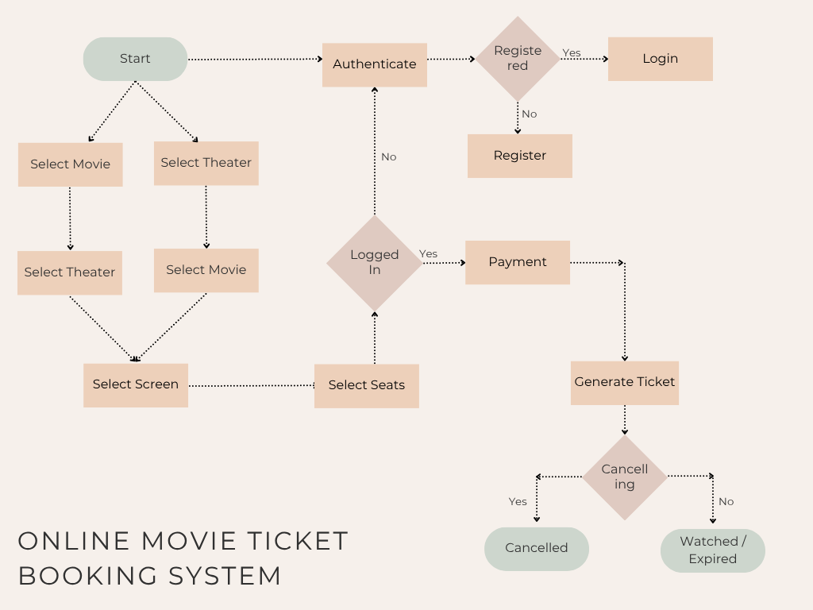
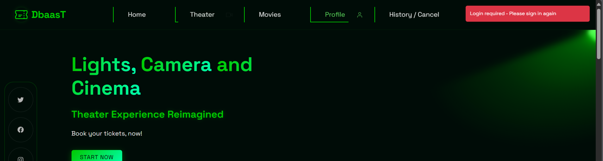

### ONLINE MOVIE TICKET BOOKING SYSTEM

---

### Project Structure

```
|_frontend_react
| |_public
| |_src
|_backend
| | _route
| | |_admin_route.py
| | |_user_route.py
```

---

### Demo Video

https://drive.google.com/drive/folders/16VhZIcVPA2lbiQQFT-74fzWj9d_jyYY9

---

### Flow Diagram



---

### schema Diagram


---

### Project Description

This project is aimed to demonstrate a fully efficient Movie Ticket Bookig through online, minding User experience, Concurrency handling, Admin handling all in one place.

**At user side:**

- User can navigate through recent movies, all movies and book a ticket. User can select Movies based on recency and older.
- User can select a theater, which is displayed based on beng near to farther away from their cuurent location and book a ticket. User can choose theaters based on parking being available, accessible to disable people.
- User can select a show time from a screen of their convience from the selected theater for their selected movie.
- User can select any number of seats in a screen from different categories. It takes care of concurrency handling, taking care of atomicity as well.
- User can cancel the booked tickets, before the day of show.
- Seat selection is parallelled, implying seats are blocked if other user booked the seats in same screen at same showtime.
- History dashboard helps to lists their booked movies, cancelled movies, expired movies.
- User profile helps user to look into their details.
- User side also provides, Contact side, Social media links to get in touch with the Admin.

**At admin side:**

- Admin can view all available Movies, Theaters, Screens, Shows
- Admin can add/ delete new Movies, Theaters and Screens and Shows.
- Admin side is very protected to prevent commiting DB actions that questions DB integrity, for instance adding a new Movie that might overlap, deleting a Movie that users booked, etc.,.

---

**Triggers:**

- Preventing overlap of shows with Hibernating period of 1 hours after or before the other show.
  For instace if a movie is already scheduled at 18:00:00, and it runs for 2hrs, a new movie cant be added till movie ends along with mandatory screen hibernation period of 1hr. Thus the movie ends at 20:00:00, but a new movie can be only added after 21:00:00
  Similarly if we try to add a movie before it, it considers that movie runtime and hibernation period and prevents it from overlapping with existing movie. Let the before be addded movie be of length 2hrs, with 1hr hibernation, the movie cant be added after 3hrs. Thus it cant be added after 15:00:00.
- Prevention of Deletion of Movies, Theaters, Screens or Shows if it has been screened with a Movie that atleast 1 user has booked. If not booked or no shows is present it can be deleted.
- Prevention of runtime update, once movie is screened.
- Creating/ Deleting seat instances as soon as a Screen has been added/ deleted, which triggers bookings table to remove the total revenue generated, all_bookings table to updatte status of user.
- Resetting seat instances as soon as date of that show gets changes, which triggers bookings, all bookings as well.

---

**Authention and Authorization:**

- Lets user access Profile, History only after Login.
- Lets user Book, Cancel only after Login.
- Other features like search are not limited to user authentication.
- Authentication done by JWT token, with access token living upto 10mins and refresh token living upto 10 days.
- React Authorization prevents user from accessing Admin side page (React-based route guarding ).
- URL navigation, SQL injection are prevented by JWT, Prepared statements.

---

**Microservices:**

- JWT Authentication.
- React Authorization Guarding.
- Location based Theater search.
- Booking Service.
- Cancellation Service.
- DB CRUD Services.

---

### Screenshots

- User Home Page

  

- User Profile

  

- User History

  

- Carousels

  

- Movies

  

- Theaters

  

- Shows

  

- Seats

  

- Payment

  

- Ticket Generation

  

- Login Required

  

- Admin Home Page

  

- Adding Movies

  

- Adding Theaters

  

- Adding Shows

  

- Example CRUD on Existing Movies

  
